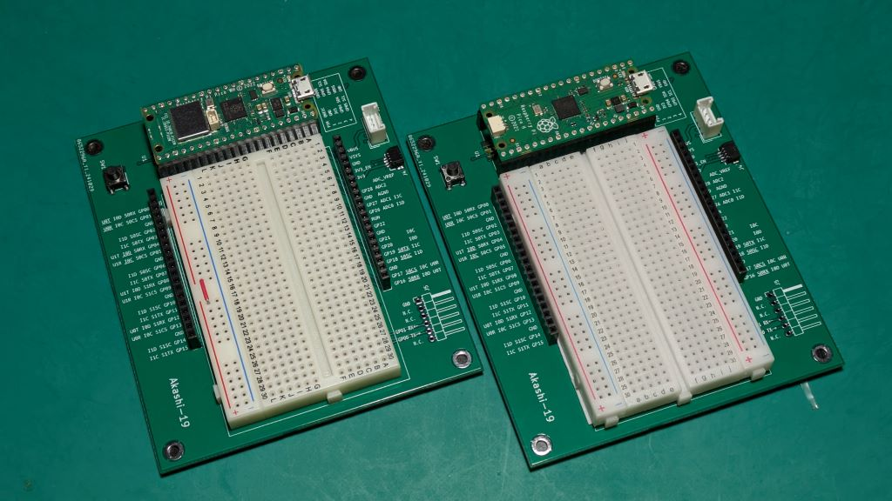

# Akashi-19
Raspberry Pi Pico Breadboard platform. 

# Details

A board with Raspberry Pi and Breadboard together. 

Features :
- Support two popular bread boards. 
- Pin labels next to the sockets. 
- Reset switch. 
- UART connector ( FTDI pin assign ).
- QWIIC connector ( 3.5V Vdd / 3.3V signal ).
- GROVE connector ( 5.0V Vdd / 3.3V signal )

The circuit schematics are available [here](docs/Akashi-19.pdf). 

